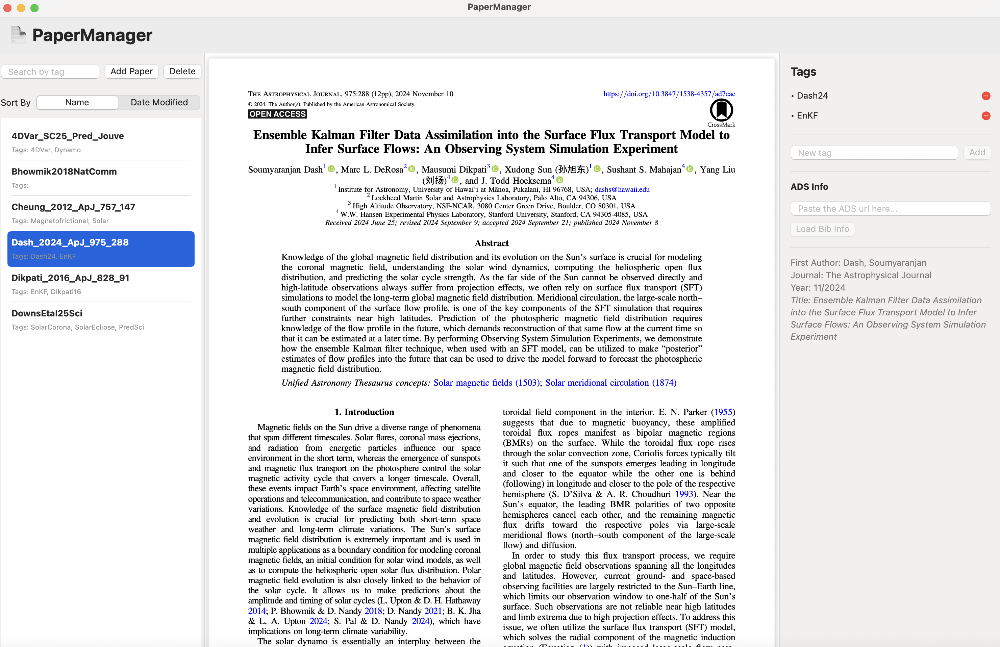

# 📄 PaperManager

A macOS SwiftUI app to manage academic papers and tags with built-in PDF viewing and tagging functionality.

## ✨ Features

- Import and preview PDF papers
- Tag papers with custom labels
- Search by tags
- Smooth PDF reader experience
- Add tags live to selected papers
- Sort added papers by name or date-modified
- Delete added papers
- Add NASA ADS link to fetch bibliography info for the selected paper

## 🚀 Installation

1. Copy the PaperManager.app file to your Application directory.
2. Open `PaperManager.app` and use.
3. Run the app on macOS 13.0+.

## Data Usage

- The app stores (creates a copy) the uploaded pdf file to the local Application directory.
  This means (if you accidentaly delete the source PDF file, you have a copy of it within the App directory) you can read the paper within the application anytime you want unless you delete the entry from the application.

## 📚 Documentation

- [User Guide](Docs/user_guide.md)
- [Installation Instructions](Docs/installation.md)
- [Developer Guide](Docs/developer_guide.md)

## 🧩 Version

Latest: **v1.0.1** — Released: 2025-06-12  
See [CHANGELOG](CHANGELOG.md) for full history.
